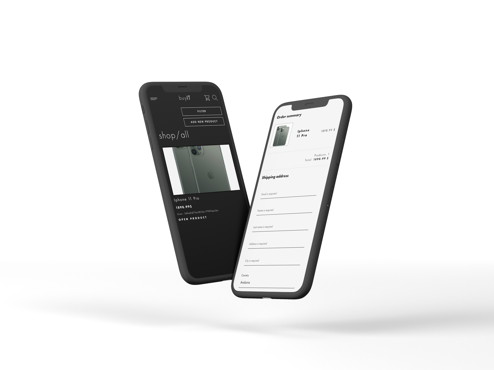
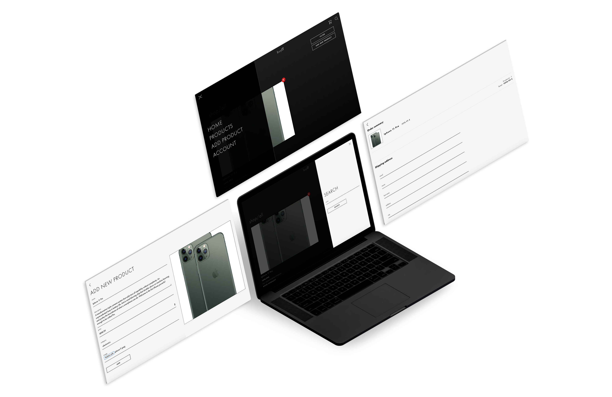

## Buy IT e-commerce project

e-commerce project with full backend written in React, Redux on client side, and NodeJS with Socket.io
on backend.

### `Quick description`

Users can create an account and log in to it. NodeJS backend will hash password and return web token to the client.
Logged in users can add product with a quick description and a price, then thanks to `socket.io`, product will be
shown to every single user browser with no need to refresh the page.

After adding product to cart, socket.io will show all users that product is being reserved. Product
will be in cart for 15 minutes, then if user won't order this product, it will be removed from the cart,
and it will be visible to all users again.

Users can `add, remove, order and reserve` products from the database.

Icons provided by: [Flaticon.com](https://www.flaticon.com/)

#### `Technologies used:`

`Frontend`

- React / Redux
- Styled components

`Backend`

- NodeJS
- Socket.io
- MongoDB
- AWS S3 `to store images`

